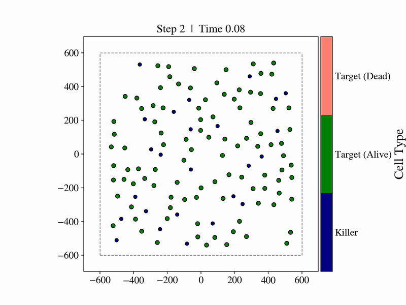
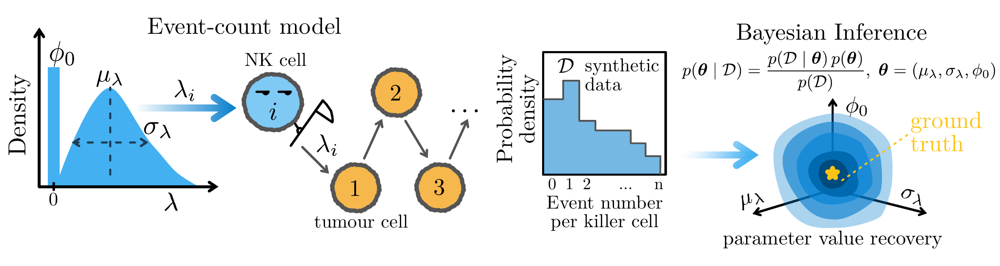
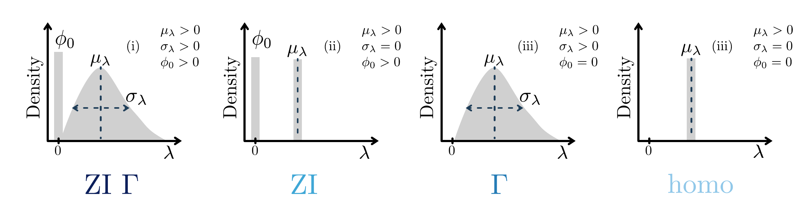

# MantiShrimp

MantiShrimp is a Python package for agent-based modelling of killer immune
cell–tumour cell interactions and Bayesian analysis of the resulting
cell-level event counts.

The package has two connected layers:

- an off-lattice, two-dimensional ABM using the refined Hookean interaction
  rules from Szonja Skenderovic's thesis;
- the four Bayesian count models from the Orca inference work, applicable to
  either contacts per killer cell or kills per killer cell.

The historical scripts and notebooks remain in the repository as provenance.
New work should use the importable package under `src/mantishrimp`.

## ABM demonstration



Blue agents are killer immune cells, green agents are living tumour targets,
and salmon agents are dead targets. Cells move continuously in the off-lattice
domain; killer-target proximity can lead to stochastic synapse formation,
damage accumulation, and target death. The animation is a visual illustration
of one run rather than a calibrated biological prediction. A
[full-resolution version](figures/vis_test.gif) is also available.

## Install

```bash
python -m pip install -e .
python -m pip install -e '.[inference]'
python -m pip install -e '.[all]'        # inference, plotting, and tests
```

Python 3.10 or newer is supported.

## Simulate killer–target interactions

```python
from mantishrimp import SimulationConfig, simulate

config = SimulationConfig.szonja_baseline(
    n_killers=25,
    n_targets=100,
    duration=25.0,  # shortened from the 80-minute thesis baseline
    seed=42,
)
result = simulate(config)

print(result.summary())
print(result.contacts_per_cell())
print(result.kills_per_cell())
```

`SimulationResult` contains:

- `snapshots`: one row per recorded cell and time point;
- `events`: contact, synapse, and death events with killer/target identities;
- `final_cells`: the final recorded population state;
- `config`: the complete typed simulation configuration.

Contacts and synapses are deliberately different. A contact is a proximity
episode; a synapse is a stochastic bound state formed during contact. This
keeps the biological mechanism separate from the observable used for
inference.

## Infer heterogeneity from ABM results

The inference layer asks a population-level question: **are killer cells
consistent with one common event rate, or is there evidence for inactive cells,
continuous rate heterogeneity, or both?** It operates on one integer count per
killer cell. That count can be either the number of contact episodes or the
number of attributed kills.



The workflow above has three steps:

1. Each killer cell `i` has a latent event rate $\lambda_i$.
2. Over exposure time $T_i$, its observed count is modelled as
   $N_i\mid\lambda_i,T_i\sim\operatorname{Poisson}(\lambda_iT_i)$.
3. Bayesian inference combines the count likelihood with the parameter priors
   to estimate $p(\theta\mid\mathcal{D})$, where
   $\theta=(\mu_\lambda,\sigma_\lambda,\phi_0)$.

Here $\mu_\lambda$ is the mean event rate among active killer cells,
$\sigma_\lambda$ is their between-cell rate variation, and $\phi_0$ is the
fraction of structurally inactive killer cells. Zero-count cells are retained:
an observed zero can arise either from an active Poisson process that happened
to produce no events or, in zero-inflated models, from the inactive component.
The default exposure is the simulated duration, although aligned per-cell
exposures can be supplied directly.

### Four candidate population models



The figure expresses the four models as restrictions of the same latent-rate
distribution. The grey/blue mass at zero is $\phi_0$; the positive-rate
distribution has mean $\mu_\lambda$ and standard deviation
$\sigma_\lambda$.

| Package name | Figure | Parameter restriction | Count distribution | Interpretation |
| --- | --- | --- | --- | --- |
| `homo` | homo | $\sigma_\lambda=0,\ \phi_0=0$ | Poisson | one shared rate |
| `Z2P` | ZI | $\sigma_\lambda=0,\ \phi_0>0$ | zero-inflated Poisson | shared active rate plus inactive cells |
| `Dis2P` | $\Gamma$ | $\sigma_\lambda>0,\ \phi_0=0$ | negative binomial | Gamma-distributed active-cell rates |
| `hetero3` | ZI $\Gamma$ | $\sigma_\lambda>0,\ \phi_0>0$ | zero-inflated negative binomial | Gamma rates plus inactive cells |

For the Gamma models, integrating the cell-specific $\lambda_i$ values out of
the Poisson likelihood gives the negative-binomial count distribution. This
lets the model estimate continuous cell-to-cell variation without sampling a
separate rate for every killer.

The original vector figures are available as
[the inference workflow PDF](figures/syn_vali.pdf) and
[the four-model PDF](figures/models.pdf).

### Fit contacts and kills separately

Install the `inference` extra, then fit the same candidate suite to each
observable:

```python
from mantishrimp.inference import evidence_table, infer_contacts, infer_kills

contact_fits = infer_contacts(
    result,
    draws=1000,
    chains=2,
    random_seed=42,
)
kill_fits = infer_kills(
    result,
    draws=1000,
    chains=2,
    random_seed=43,
)

print(evidence_table(contact_fits))
print(evidence_table(kill_fits))
```

Contacts and kills should be analysed as separate datasets because they answer
different biological questions: contact inference characterises encounter
opportunity, whereas kill inference combines encounter, synapse, damage, and
cytotoxic competence.

### Posterior recovery and model comparison

Models are fitted with PyMC Sequential Monte Carlo (SMC). Each `FitResult`
contains posterior samples for parameter recovery and a log marginal
likelihood for model comparison. With equal prior model probabilities,

$$
\mathrm{BF}_{A,B}=\frac{p(\mathcal{D}\mid M_A)}{p(\mathcal{D}\mid M_B)}
=\exp\left(\log Z_A-\log Z_B\right).
$$

The posterior answers *which parameter values are plausible within a model*;
the Bayes factor answers *which population model is better supported by the
observed counts*. `evidence_table`, `bayes_factor_matrix`, and the plotting
helpers expose both views. Raw count arrays can also be fitted with
`fit_count_model` or `fit_model_suite`.

This count likelihood is an observation model for ABM outputs; it does not by
itself infer Hookean force constants, motility parameters, or causal cell-cell
network structure. Those would require a separate calibration or
simulation-based inference layer.

## Package map

- `config.py`: validated simulation parameters and the Szonja baseline;
- `simulation.py`: Hookean ABM engine;
- `results.py`: event-count extraction and result persistence;
- `inference.py`: Orca-derived Bayesian model suite;
- `validation.py`: synthetic Poisson/Gamma/zero-inflated generators;
- `analysis.py`: evidence, posterior, sweep, and persistence helpers;
- `plotting.py`: reusable posterior and Bayes-factor plots.

See [docs/model.md](docs/model.md) for the scientific rules and
[docs/notebook-migration.md](docs/notebook-migration.md) for the extracted
notebook-function map.

## Development

```bash
python -m pip install -e '.[all]'
pytest
```

The package is currently alpha software. Before using it for biological
claims, calibrate the time/space units, parameter priors, and observation
process against the experiment being modelled.
